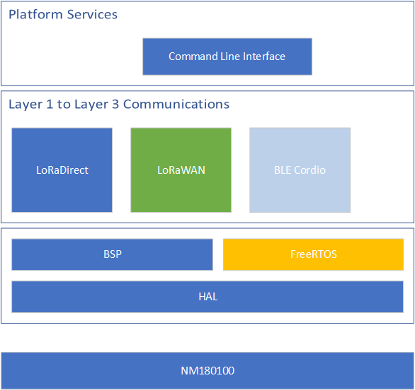

# Northern Mechatronics Software Development Kit
License : [](http://gitlab.northernmechatronics.com:50250/nmi/software/nmsdk/blob/master/LICENSE)

Platform Details: [](https://www.northernmechatronics.com/nm180100)

## Overview
The NMSDK is a platform library for the Northern Mechatronics NM180100 LoRa BLE module.
It provides support for LoRa direct, LoRa real-time, LoRaWAN, and BLE wireless connectivity as well
as a FreeRTOS framework for rapid application development across a wide range of use cases and environments.
As of May 2021, NVM context management (a mandatory feature in v1.0.4 but supported in v1.0.3) is enabled by default.
Two flash pages located at the end of the flash memory are used for LoRaWAN context storage.  If your application uses
the on-chip secure storage space, please ensure that you implement

```secure_store_master_key_read```

If the function is not implemented, the default master key for the secured
storage space is

```0xFF 0xFF 0xFF 0xFF 0xFF 0xFF 0xFF 0xFF 0xFF 0xFF 0xFF 0xFF 0xFF 0xFF 0xFF 0xFF```

Architecturally speaking, the SDK consists of three layers



## Supported Host Platforms

For more details on building the SDK on a host platform, please check the **User Guide** specified below for either the Windows OS or the Linux OS.

## Directory Structure
| Directory | Description |
| --------- | ----------- |
| bsp | Pre-defined board support packages |
| doc | Documentation |
| features | SDK bindings and build scripts for other software packages |
| platform | NM platform service code |

## Build Instructions
### Pre-requisites
* git
* make
* sed

### Installation
* Clone the [NMSDK](https://github.com/NorthernMechatronics/nmsdk).

```git clone https://github.com/NorthernMechatronics/nmsdk.git```

* Download and install the [AmbiqSuite](https://ambiq.com/wp-content/uploads/2020/09/AmbiqSuite-R2.5.1.zip).

* Clone [FreeRTOS](https://github.com/FreeRTOS/FreeRTOS-Kernel).

```git clone https://github.com/FreeRTOS/FreeRTOS-Kernel.git```

* Clone the [LoRaWAN](https://github.com/Lora-net/LoRaMac-node) stack

```git clone https://github.com/Lora-net/LoRaMac-node.git```

* Change to the project directory and switch to the final release of the LoRaWAN
L2 v1.0.3 tag

```cd <LoRaMac-node directory>```

```git checkout v4.4.7```

### Build Setup
* If you did not use the default locations, open the Makefile and modify the following variables to point to the location where you have cloned or downloaded the various SDKs:
    - AMBIQ_SDK
    - FREERTOS
    - CORDIO
    - UECC
    - LORAMAC
* If all the SDKs are located within the same parent folder, there is no need to modify the variables as the build
script will automatically search for the correct paths.

### Build
* Type `make` for release and `make DEBUG=1` for debug.
* Note that in the release configuration, the Ambiq's HAL API validation and parameter checking are disabled.
